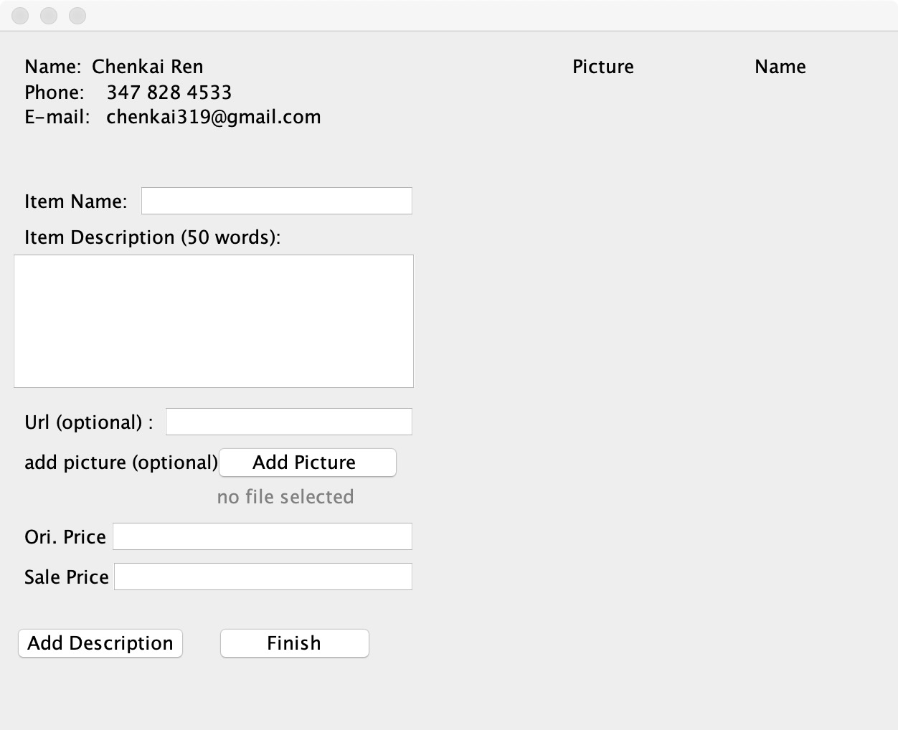
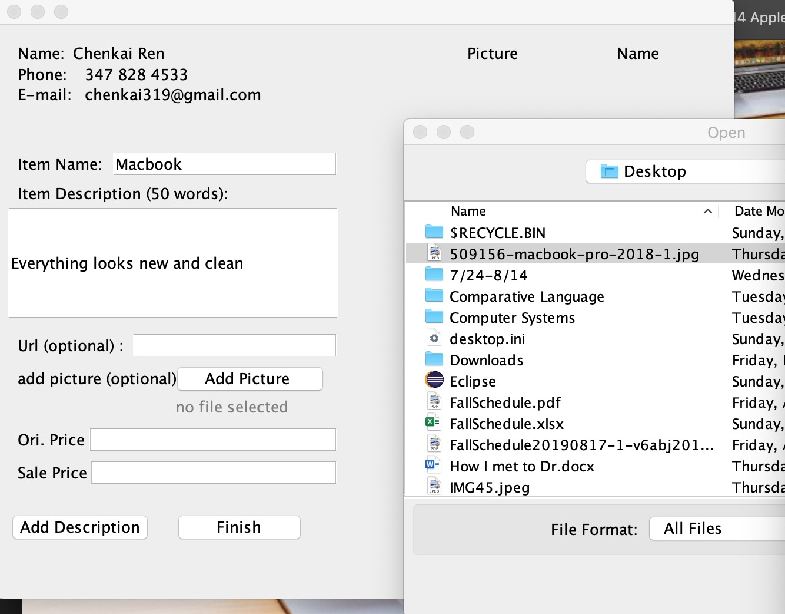
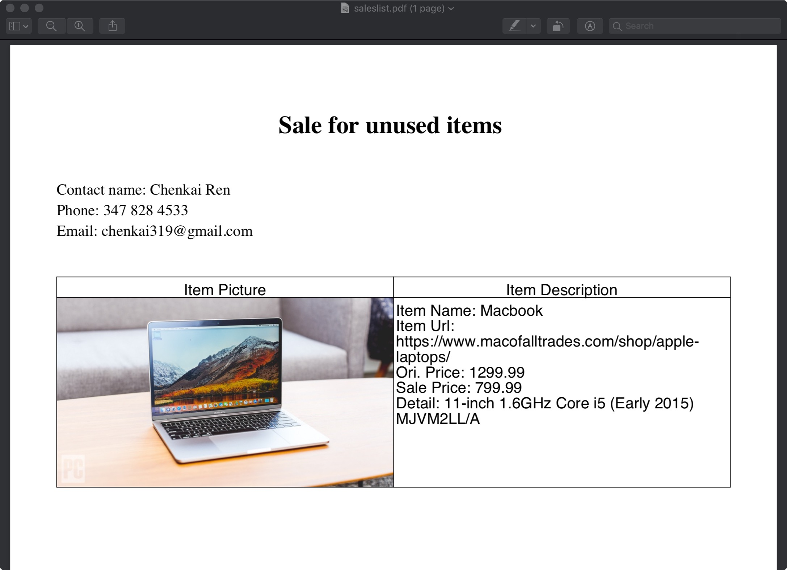

# Sale-System
Chinese Student and Teachers at Virginia Tech are thinking selling stuff through group or wechat. They normally use a pdf or just images to advertise their objects. I have heard many of people had a struggle to organize their information into the pdf. This application helps them to organize what will be on the pdf file. 

# Downloads Needed
itext-5.0.2.jar -> http://www.java2s.com/Code/Jar/i/Downloaditext502jar.htm

eclipse -> https://www.eclipse.org/

# SKills Needed 
Java -> http://www.tutorialspoint.com/java/

# Tutorials
application has not been completed yet. Tutorials will later be updated. 
I used Itext (open-source) to create and managed pdf files. 

# Hints
I have experience with java so it's easier for me to code this project. For those who are new to java, it very helpful to review the link I provided above to understand how java programming language is like before you start writing in eclipse. 

Here is the application's GUI. I want to keep simple and easy to use. 

